# Exercise 1.1: Univariate Time Series - General Aspects

For this exercise, the dataset `laborforce.RData` has been selected (as per professor's suggestion). First we show how to prepare the data in the cell below.

```
# Prepare environment

# Load packages
library(fpp2) # The time series package
library(stringr) # Work with strings
library(dplyr) # Work with data frames easily

# Set constants
DATASETS_DIR = "../datasets"

# Instruction > Select one of the univariate (U) sample data sets available!
DATASET_FILE = "laborforce.RData" 
DATASET_FULL_PATH <- str_c(DATASETS_DIR, "/", DATASET_FILE)
```

```
# Prepare data
data <- load(DATASET_FULL_PATH)
data <- get(data) # The actual object. We will see it twice in the environment
data <- select(data, -CO2, -unemployment) # We want to work with UniVar dataset

# This dataset starts at 1948 and has been collected in a monthly basis
data.ts <- ts(data$laborforce, start = 1948, frequency = 12) 
```

Note that the span for this dataset is 52 years.
## a) 

### Make a time sequence plot of the selected data and perform an Exploratory Data Analysis: Characterize the main properties of the time series, such as trend, seasonal variation, cyclic variation, irregular variations, sudden changes in the data and/or possible outliers.

```
# Make the time sequence plot
tsdisplay(data.ts)
```
Initial time sequence plot                            |
:----------------------------------------------------:|
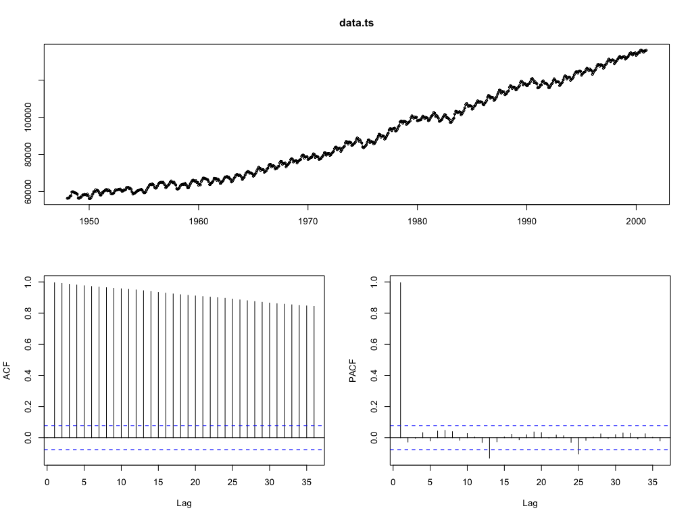 |

**Exploratory Data Analysis**

- _Trend_: We can clearly observe a trend on the labor force which looks polynomial at first glance. Also, from the ACF we can see that the trend is present due to the slow decreasing in the positive values at low lags.
- _Seasonality_: Yes, in the information we visualize, there is a seasonal factor per year, that is continously repeated, though it is not completely evident.
- _Cyclyc variation_: No cyclic variation observed.
- _Irregular variation_: No irregular variation observed.
- _Sudden changes and/or outliers_: Yes. At some points (e.g. `~1975`) there are sudden changes that even when the trend and seasonality are preserved, outstand in the observed pattern.


## b)

### If the time series selected exhibits trend, describe ways to correct for it. 

We should perform finite differencing.

### Explain how finite differencing might correct for trend. 

Finite differencing may expose the change at each step on time. This is, if from one month to another a big change ocurred, we consider only this effective change (delta). Hence, we will not observe the trend, but the actual variations during time.

### Experiment with the effect of finite differencing on the data set selected and perform an Exploratory Data Analysis on the result obtained. Do you expect for the data set selected that it is needed to do this finite differencing more than once to correct for trend? Check your conjecture with R!

The trend is not drastically increasing, so we would expect to get good results with 1 correction only.

```
# Checking conjecture with R
# Testing 1 correction. i.e. lag_step = 1
data.d1 = diff(data.ts, differences = 1)
tsdisplay(data.d1)

# Testing 2 corrections. i.e. lag_step = 2
data.d2 = diff(data.ts, differences = 2)
tsdisplay(data.d2)
```

1 differentiation                                  |  2 differentiations
:-------------------------------------------------:|:-------------------------:
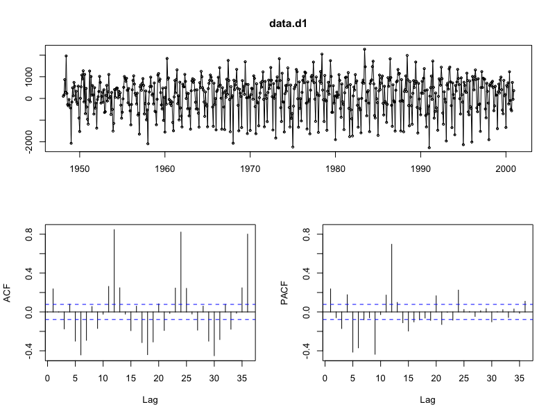  |  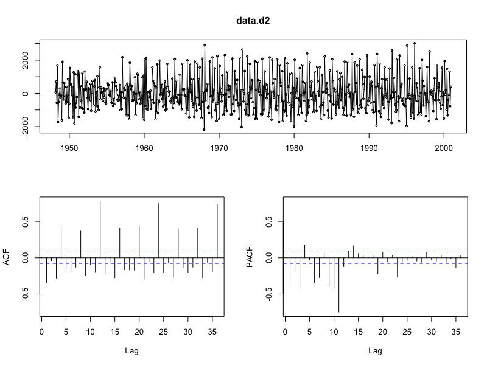

**Analysis**

It can be seen that with only 1 differenciation we 'removed' the trend. As expected (since we are just applying differencing for trend), by looking at the ACF we observe the seasonality behaviour. Note that this was not evident in the initial plot, hence we have "naked" this property as a consequence of removing the trend.

## c) If the time series selected exhibits seasonality, determine the period of seasonality and argue if an additive or a multiplicative seasonal model seems most adequate.

The period is 1 year. (Recall that our data is shown in a monthly basis, i.e.`frequency = 12`).

With respect to the most adequate model, from theory (ffp2 book) we know that: 

> The additive decomposition is the most appropriate if the magnitude of the seasonal fluctuations, or the variation around the trend-cycle, does not vary with the level of the time series. When the variation in the seasonal pattern, or the variation around the trend-cycle, appears to be proportional to the level of the time series, then a multiplicative decomposition is more appropriate. Multiplicative decompositions are common with economic time series. Multiplicative can be performed many times to correct (similar to trend correction).

Hence, Additive decomposition should be the most adequate.

## d) 

### Explain how seasonal differencing might correct for seasonality of the time series. 

As for trend, the difference beteween moments in time will be computed but, in this case, the `lag = 12` indicates that for each observation (monthly measure) we will compare with the next year's observations. This is, january-janyary, february-february, etc. Hence, for each month we will obtain how it has changed with respect to the overall months and not the change at each month. The best case is that months change in the same proportion and then the seasonality would be completely removed (additive assumption), but if that is not the case then we will still observe some "seasonality", suggesting that some months have more variation (multiplicative assumption).

### Experiment with the effect of seasonal differencing on the data set selected using R and perform an Exploratory Data Analysis on the result obtained. Do you expect for the data set selected that it is needed to perform seasonal differencing more than once to correct for seasonality? Check your conjecture with R!

```
# lag = 12 because of monthly data
data.sd1 <- diff(data.ts, lag = 12, differences = 1) # velocity
tsdisplay(data.sd1)

data.sd2 <- diff(data.ts, lag = 12, differences = 2) # acceleration
tsdisplay(data.sd2)
```

1 differentiation                                   |  2 differentiations
:--------------------------------------------------:|:-------------------------:
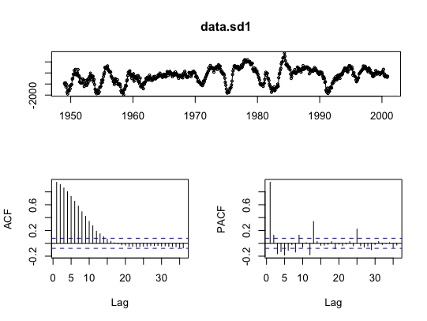  |  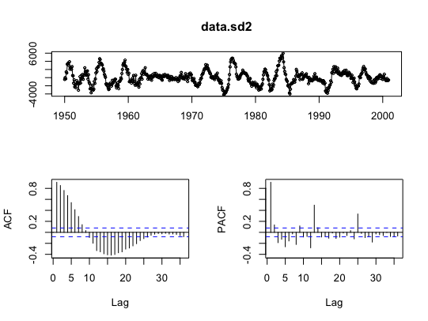

**Analysis**

In the PACF we still observe some seasonality but no drastic change from 1 correction to 2 corrections is obtained. We observe however the trend, which is expected. We keep 1 differentiation.

> Professor: When observed negative values one should think of "decrease" from period to period. As in the PACF we still observe some seasonality behavior (at lags 12 and 24), we should choose the sd2.

## e) To correct the time series selected both for trend and seasonality combine both finite and seasonal differencing, as applied in part b. and d., to the original data and perform an Exploratory Data Analysis on the result obtained. Are trend and seasonality adequately removed? Does the resulting time series look like random noise or is it still containing any structure?

```
data.corrected = diff(data.ts, differences = 1)
data.corrected <- diff(data.corrected, lag = 12, differences = 1)
tsdisplay(data.corrected)
```

Corrected with 1 seasonal differentiation              |  Corrected with 2 seasonal differentiations
:-----------------------------------------------------:|:-------------------------:
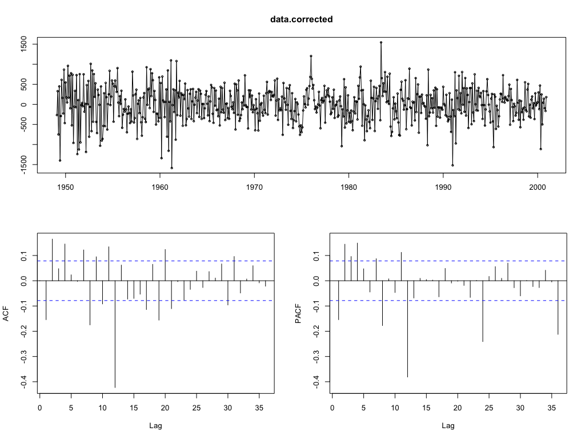  |  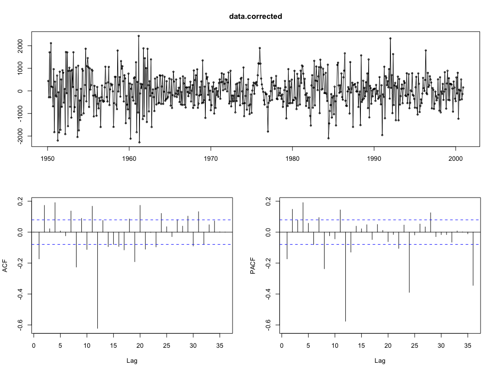

**Analysis**

We observe (and confirm) that there is no drastic change between the correction with 1 or 2 seasonal differentiations. Trend is correctly removed but still "seasonality" is observed, though with a slightly different meaning as explained in **d)**. The trend does indeed look as random noise for some periods. An interesting point is the value `~1975` which seams to outstand from the rest of the "noise".

## f) If the original time series selected exhibits seasonality, perform an adequate seasonal decomposition using the `decompose` function. Obtain estimates for the Seasonal Factors and explain how they are to be used. Also perform an Exploratory Data Analysis on the residuals of errors: anything special detected?

-----
### Before correction
```
# Multiplicative Y[t] = T[t] * S[t] * e[t]
data.deco.mult <- decompose(data.ts, type = "multiplicative")
plot(data.deco.mult)

# Additive. Y[t] = T[t] + S[t] + e[t]
data.deco.add <- decompose(data.ts, type = "additive")
plot(data.deco.add)

data.deco.add$figure # global seasonal estimates
```

```
 [1] -1764.98037 -1593.30889 -1092.22236  -573.81290    26.04848  1084.17829
 [7]  1586.77764  1262.60777   238.31370   642.31611   322.74079  -138.65825
```

Additive                                   |  Multiplicative
:-----------------------------------------:|:-------------------------:
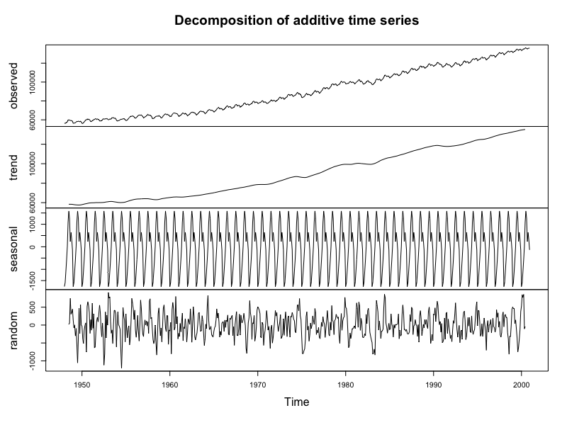  |  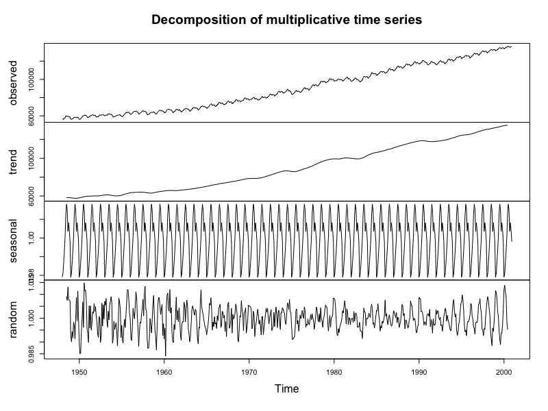

**Analysis**

In both cases, the trend component is obtained with moving averages. With respect to the seasonality, the seasonal component is abstracted from the global (all time) behaviour and then replicated at each month. We can see that the seasonal factor for additive decomposition lies close to [-1000, 1000] whereas in the multiplicative approach lies in a close interval around 1 (since it is multiplicative, high values are not expected). 

While looking into the residuals (random component) one can notice that the additive model isolates better the randomness of the data, since for the multiplicative approach we can cleary see repetitive `low, high, low high` changes with some patter behind.

Before making the signal stationary, we observe that the estimates suggest that some months decrease (negative sign) the laborforce, namely "Jan, Feb, Mar, Apr, Dec". The others contribute possitively to the outcome.

-------

### After correction 
```
data.corrected.dec <- decompose(data.corrected, type = "additive") # other: multiplicative
plot(data.corrected.dec)

data.corrected.dec$figure # Global Additive Seasonal Factors

# If all the seasonal factors (not only global) need to be displayed
# data.corrected.dec$seasonal
```

```
 [1]   8.546243  -4.932515   5.761112 -24.778103   8.142648   3.185769 -10.423528
 [8] -12.694770  11.205557   2.505394   6.239871   7.242322
```

Decomposition after correction                                |
:------------------------------------------------------------:|
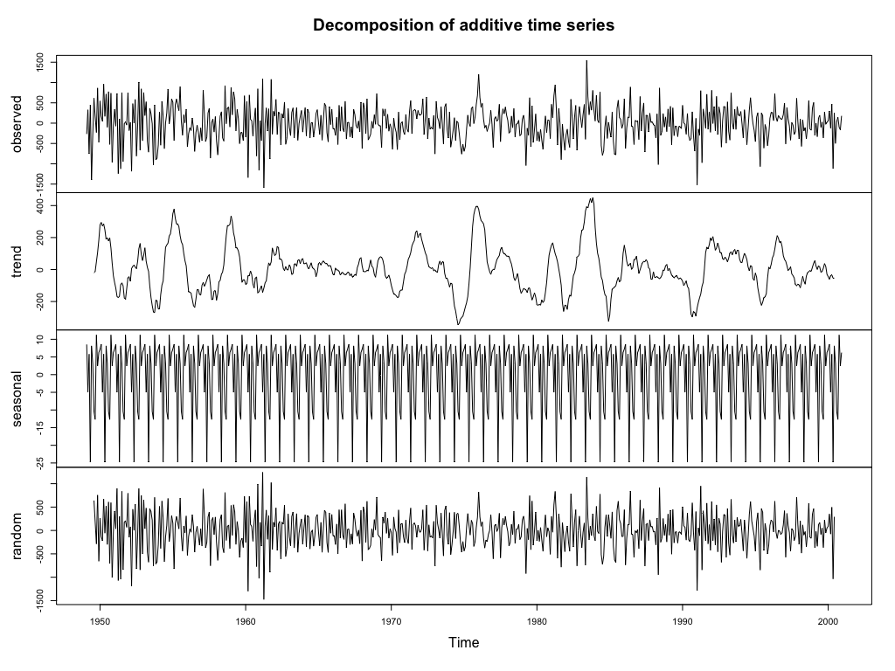   |

**Analysis**

We observe that after making the corrections to make the signal stationary, the seasonal factors now suggest that the months of "Feb, Apr, Jul, Aug" are the ones contributing negatively to the outcome.  Sep seem to be the month where the laborforce increases more notably.

Note that the randomness of the residuals seems legit.

## g) Repeat the previous analysis by intentionally (!) applying an inadequate seasonal decomposition to the time series selected, i.e. a multiplicative model where an additive model is expected or the other way around. Try to explain special features in the results obtained!

```
 [1]  5.7332343  0.8430861  2.7634350 -1.1488504 -0.1684368  0.0325429  0.2390554
 [8]  1.4268704 -0.7600139 -1.2315610  1.6249044  2.6457334
```

```
data.corrected.dec2 <- decompose(data.corrected, type = "multiplicative")
plot(data.corrected.dec2)
```

With this decomposition, the months contributing negatively are now "Apr, May, Sep, Oct" and the residuals are much less random.


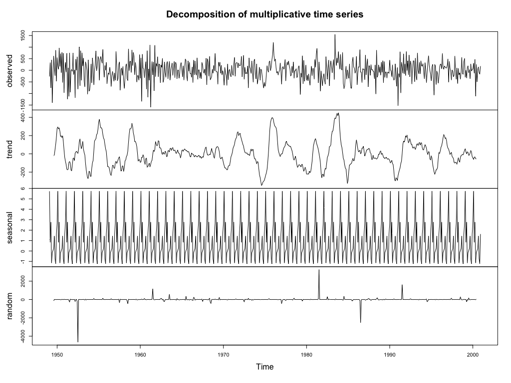 


# Things learned from this exercise

- Applying finite differencing too many times is not recommended because the "error" increases.
- When applying the wrong decomposition, residuals shouldn't look that random. 
- For multiplicative decomposition, the ratio is in the middle of the trend (?????) and 1. For additive is 0... ?????