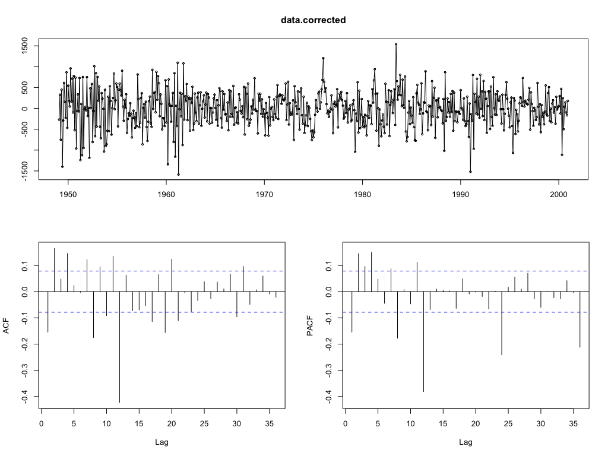
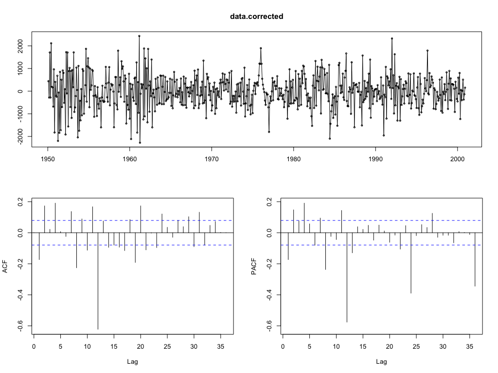
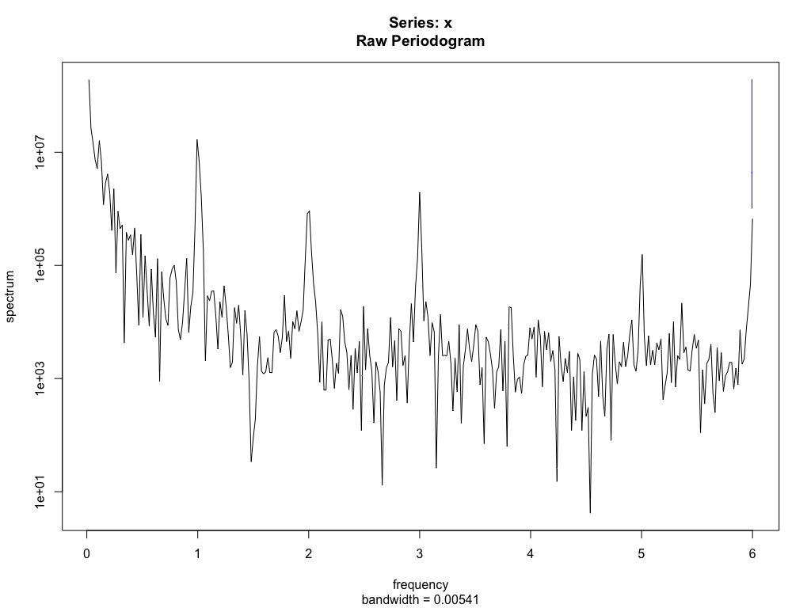

# Exercise 1.2: Univariate Time Series - Fingerprinting !

In Exercise 1.1 you performed an Exploratory Data Analysis on some of the sample data sets. Now continue with a further analysis of these data sets selected by studying their fingerprints both in the time and the frequency domain!

## a) Obtain _the fingerprint_ of the (original) time series in the time domain by calculating the sample autocorrelation and partial autocorrelation function and comment on the results!

Initial time sequence plot                            |
:----------------------------------------------------:|
 |

From the ACF we can see that the trend is present since for each `r_i` the value decreases at each value of `i`, suggesting that continous increments per unit (months) are observed. On the other hand, from the PACF it is remarkable that at each new year, negative correlation is found, suggesting a decreasement at the beginning of each year, however the values are always close to the with noise area.

No clear seasonality is observed.

## b) Apply finite and/or seasonal differencing to the original data to correct for trend and/or seasonality. Obtain _the fingerprint_ of the transformed time series in the time domain by calculating the sample autocorrelation and partial autocorrelation function and comment on the results!

Corrected with 1 seasonal differentiation              |  Corrected with 2 seasonal differentiations
:-----------------------------------------------------:|:-------------------------:
  |  

After correction, the trend has clearly disapeared. Seasonality is not clearly observed, however we still find negative picks at r12 and r24.

## c) Obtain _the fingerprint_ of both the original and the transformed time series in the frequency domain by calculating the (smoothed) spectrum, using the `spectrum` program. Comment on the results and try to identify frequency components that are present in the results!

```
spectrum(data.ts)
spectrum(data.ts, span = 10)
spectrum(data.corrected.dec$x)
```

Original                                   |  Corrected
:--------------------------------------------------:|:-------------------------:
  |  

Original (with span)                                 |  Corrected (with span)
:--------------------------------------------------:|:-------------------------:
  |  

**Analysis**

In the original time series, we obser high values in low frequencies, suggesting trends. at each integer value of the frequency, we observe picks in the data, except for 4. After correction of both trend and seasonality, these phenomena went away.

(This should be for d1 and span = 10)
We should get rid of the low frequencies. If we correct for seasonality now, we should get rid of the picks.
