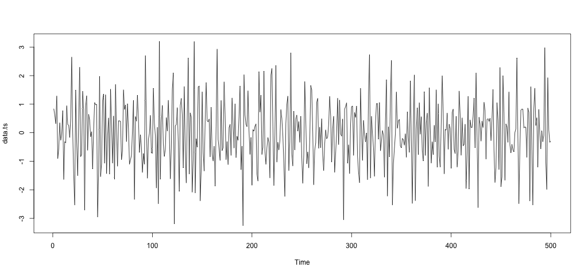
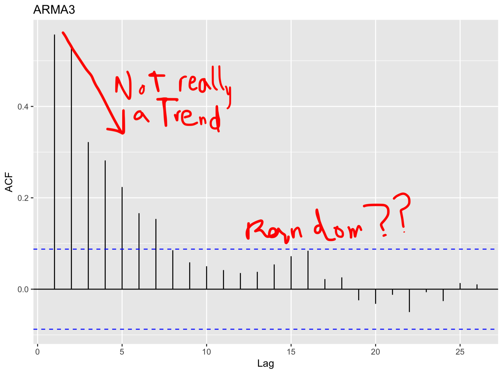
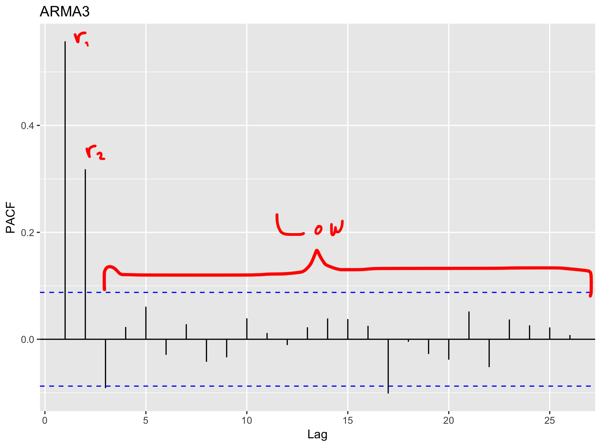
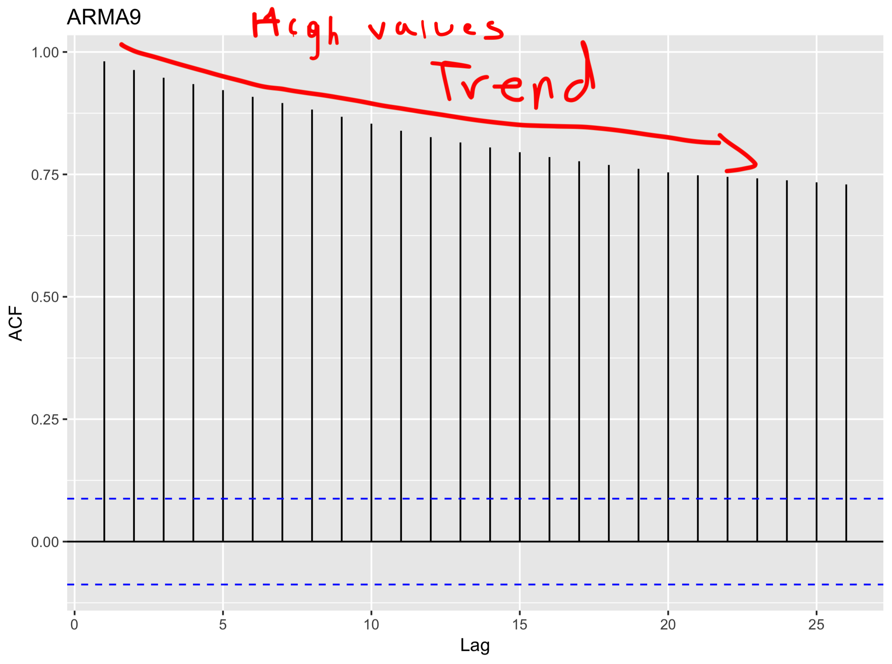
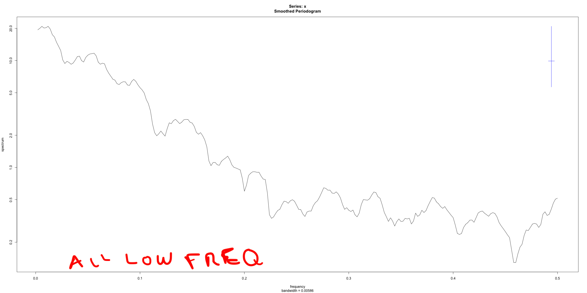

# Exercise 1.3: ARMA-models - Fingerprinting

Data set needed: `ARMAsimulations.RData`

Within the framework of Box-Jenkins models we will learn that Auto Regressive Moving Average models play an essential role. An ARMA(p,q)-model is defined according to:

where the actual value `X_t` is dependent on the actual values for the time series from the past, `X_{t-I}`, and on the actual and past values of the stochastic (or noise-related) influences, `Z_{t-j}`. We will learn how the `ARMA(p,q)` has a characteristic fingerprint in the time domain, that can be calculated from the theoretical model. However, a single realization of the specific ARMA-model, as contained in the data set `ARMAsimulations.RData`, might be used to identify the generating ARMA(p,q)-model, based on their specific characteristics.

## a) Make time sequence plots for the individual ARMA(p,q)-realizations and perform an Exploratory Data Analysis: Try to characterize the main properties of the time series, such as trend, seasonal variation, cyclic variation, irregular variations, sudden changes in the data and/or possible outliers.

Time series                       | Analysis
:--------------------------------:|---------------------------------------------
 | **ARMA1**   **Trend**: No.   **Seasonality**: Not clear.  **Cyclic variation**: Maybe.   **Outliers**: Apparently not. 
 | **ARMA2**   **Trend**: No.   **Seasonality**: No.  **Cyclic variation**: Maybe.   **Outliers**: Maybe, around 200. 
 | **ARMA3**   **Trend**: No.   **Seasonality**: No.  **Cyclic variation**: Maybe.   **Outliers**: Maybe. 
 | **ARMA4**   **Trend**: No.   **Seasonality**: No.  **Cyclic variation**: Apparently not.   **Outliers**: Apparently not. 
 | **ARMA5**   **Trend**: No.   **Seasonality**: No.  **Cyclic variation**: Apparently not.   **Outliers**: Apparently not. 
 | **ARMA6**   **Trend**: No.   **Seasonality**: No.  **Cyclic variation**: Apparently not.   **Outliers**: Apparently not. 
 | **ARMA7**   **Trend**: No.   **Seasonality**: No.  **Cyclic variation**: Apparently not.   **Outliers**: Apparently not. 
 | **ARMA8**     **Trend**: No.   **Seasonality**: No at first glance.  **Cyclic variation**: Apparently not.   **Outliers**: Maybe, around 350. 
 | **ARMA9**   **Trend**: Yes, but decreasing.   **Seasonality**: Maybe, but no strong statement can be made.  **Cyclic variation**: Maybe.   **Outliers**: Apparently not. 
 | **ARMA10**   **Trend**: No.   **Seasonality**: Not.  **Cyclic variation**: Maybe.   **Outliers**: A sudden change detected close to 400. 
 | **ARMA11**   **Trend**: No.   **Seasonality**: No.  **Cyclic variation**: No.   **Outliers**: A low value is observed around 250. 
 | **ARMA12**   **Trend**: No.   **Seasonality**: Not.  **Cyclic variation**: No.   **Outliers**: Apparently not. 

## b) Obtain 'the fingerprint' of these ARMA(p,q)-realizations in the time domain by calculating the sample autocorrelation and partial autocorrelation function. Try to identify specific features from these fingerprints and comment on the results obtained.

Time series                       |  ACF                      | PACF
:--------------------------------:|:-------------------------:|:----------------------------------------------------:
 |  | 
 |  | 
 |  | 
 |  | 
 |  | 
 |  | 
 |  | 
 |  | 
 |  | 
 |  | 
 |  | 
 |  | 

## c) Obtain 'the fingerprint' of these ARMA(p,q)-realizations in the frequency domain by calculating the (smoothed) spectrum, using the `spectrum` program. Comment on the results and try to identify frequency components that are present in the results.

Time series                       |  Spectrum                      | Spectrum span10
:--------------------------------:|:-------------------------:|:----------------------------------------------------:
 |  | 
 |  | 
 |  | 
 |  | 
 |  | 
 |  | 
 |  | 
 |  | 
 |  | 
 |  | 
 |  | 
 |  | 
