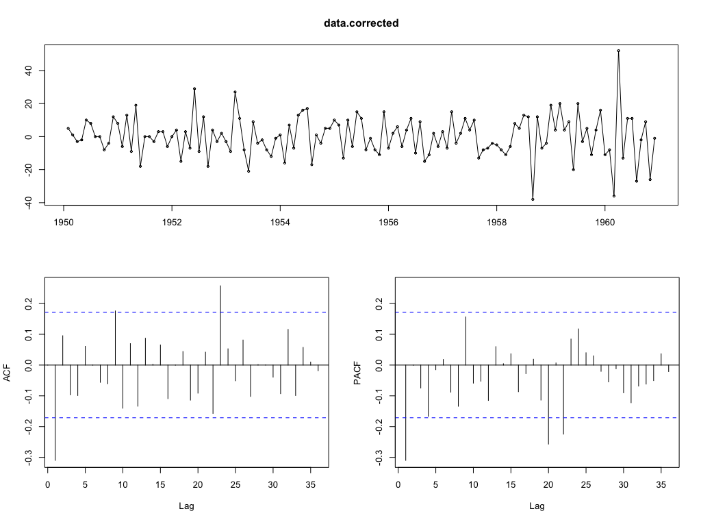
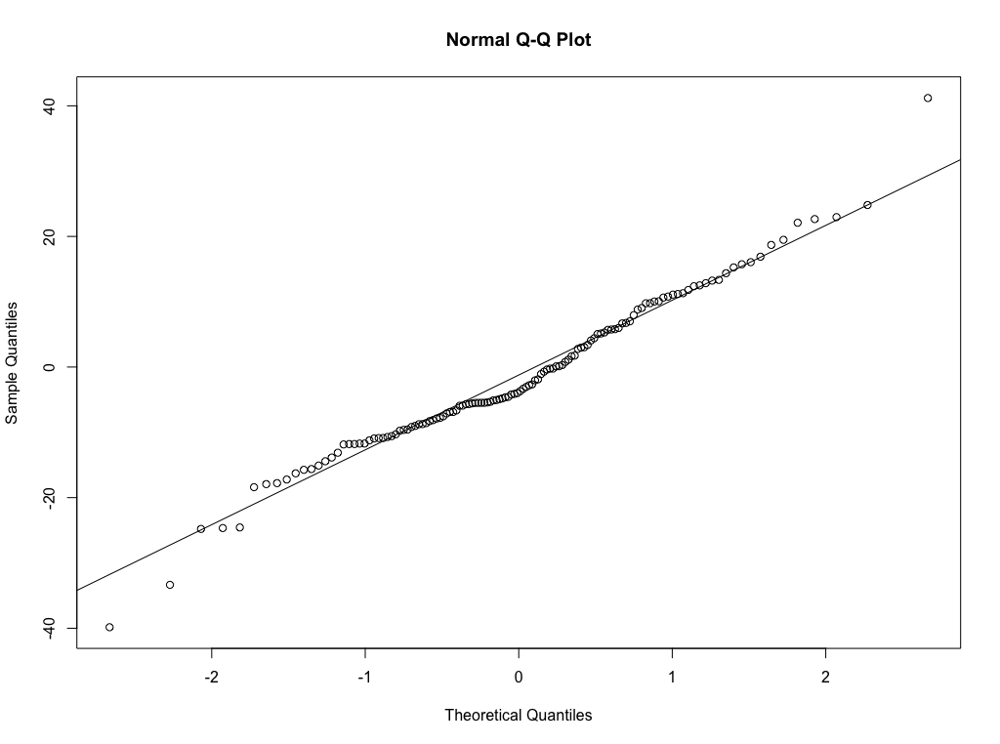
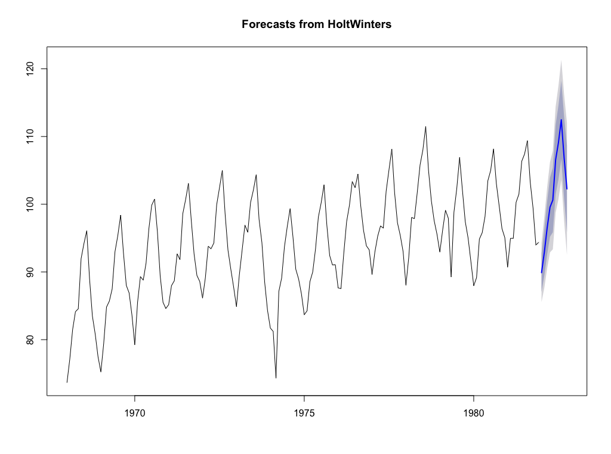
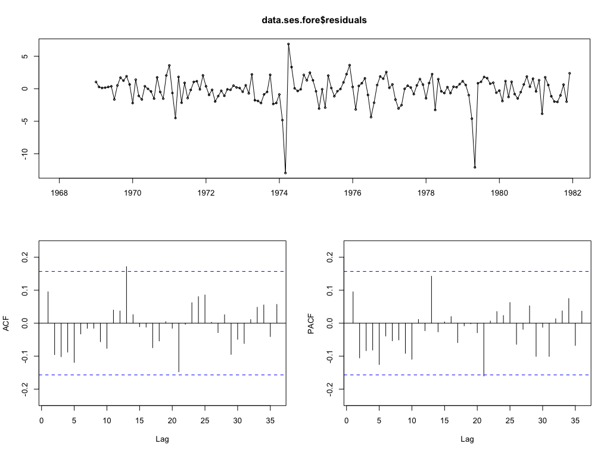

# Exercise 2.2: Univariate Time Series - Exponential Smoothing Models

**Data set needed: airline.RData**

Repeat Exercise 2.1, but now selecting the data set airline.RData, a univariate time series with both trend and a multiplicative seasonal pattern!

```
# Make the time sequence plot

tsdisplay(data.ts)
```

Initial time sequence plot                            |
:----------------------------------------------------:|
 |

## a) For the time series selected generate time series which are corrected for trend, for seasonality and for both trend and seasonality. Perform an Exploratory Data Analysis (including fingerprinting!) for the results!

### Correction for trend

```
# Perform correction

data.corrected = diff(data.ts, differences = 1)
tsdisplay(data.corrected)
```

Corrected series                            |
:----------------------------------------------------:|
 |

**Analysis**

I have corrected trend 2 times, since 1-time differencing was still keeping son trendy behaviour close to the seasonality. Actually, when removing 1-time differencing is still not clear in the PACF whether seasonality is present or not. This is solved with 2-times differencing.

### Correction for seasonality

```
# Perform correction

data.corrected <- diff(data.ts, lag = 12, differences = 1)
tsdisplay(data.corrected)
```

Corrected series                            |
:----------------------------------------------------:|
 |

**Analysis**

For seasonality, only one correction was performed, since no clear change was noticed with a higher order. This seasonality is at lags 12-13 and 24-25, as can be appreciated in the PACF. 

### Correction for both trend and seasonality

```
# Perform correction

data.corrected = diff(data.ts, differences = 2)
data.corrected <- diff(data.corrected, lag = 12, differences = 1)
tsdisplay(data.corrected)
```

Corrected series                            |
:----------------------------------------------------:|
 |

**Analysis**

The original series contain both trend and seasonality, presumably additive. After correcting for both characteristics we observe a series closer to stationary both still showing some marks of seasonality. 

## b) 

### For the generated time series, corrected both for trend and seasonality select an adequate Exponential Smoothing Model to predict future values. 

**Analysis**

Since we have corrected the trend and the seasonality, we may like trying to fit a Simple Exponential Smoothing model, which does not contain equations for trend nor seasonality but only for the level.

### Fit the model by estimating its parameters and give an interpretation for the parameter values obtained. 

```
data.ses <- HoltWinters(data.corrected, beta = FALSE, gamma = FALSE) # Output is next

Holt-Winters exponential smoothing without trend and without seasonal component.

Call:
HoltWinters(x = data.corrected3, beta = FALSE, gamma = FALSE,     seasonal = "multiplicative")

Smoothing parameters:
 alpha: 0.02531335
 beta : FALSE
 gamma: FALSE

Coefficients:
      [,1]
a 38.91969
```

Exponential Smoothing fitted                            |
:----------------------------------------------------:|
 |


**Analysis**

The `alpha` parameter indicates that we are not giving too much importance to the recent past, but giving a similar importance to all the series (since at each step we only decrease the value by less than 1%). The coefficient on the other hand is bigger but still not that significant if we consider that the range of y-axis is `[-20, 20]`. I would expect a really bad prediction, close to 0.


### Verify the model on the basis of the residuals, their (partial) autocorrelations and Goodness-of-Fit measures such as RMSE, MAE and MAPE.

**Analysis**

The first thing to evaluate is the goodness-of-fit, since it does not deppend on predictions. I decide to evaluate based on RMSE since it is unsensitive to changes in sign for the fitted and original values. 


```
with(data.ses, accuracy(fitted, x))

                ME     RMSE      MAE       MPE     MAPE       ACF1 Theil's U
Test set -1.543821 12.62507 9.806944 -51.74995 66.86276 -0.3056713 0.3721487
```

With this, we observe that the RMSE is somehow low, since we are working in the range `[-20, 20]` and this measure is averaged and squared. Indeed, this means that our average error is more or less one side of the range. 

This is not a clear indicator of the performance of the model. So we proceed to forecast and evaluate normality of the residuals and partial autocorrelations.

To verify normality of the residuals, we first forecast 10 values:

```
data.ses.fore <- forecast(data.ses, h = 10)
```

Forecast                            |
:----------------------------------------------------:|
 |


After that, we evaluate normality:

```
> shapiro.test(data.ses.fore$residuals)

    Shapiro-Wilk normality test

data:  data.ses.fore$residuals
W = 0.9714, p-value = 0.007547
```

We reject normality since p-value < 0.05 (we assume significance of 5%). We need to be careful since this test is sensitive to ties which was not verified for our dataset. By looking at the residuals we can observe this in detail.

```
qqnorm(unclass(data.ses.fore$residuals))
qqline(unclass(data.ses.fore$residuals))
```

Normality                            |
:----------------------------------------------------:|
 |

Finally, remember we look for random residuals, we verify if indeed there is randomness in their ACF and PACF.

```
tsdisplay(data.ses.fore$residuals)
```

Autocorrelations                            |
:----------------------------------------------------:|
 |

It can be observed that there is significance in some of the autocorrelations, then we perform a formal test:

```
Box.test(data.ses.fore$residuals, lag = 12, type = "Ljung-Box")

    Box-Ljung test

data:  data.ses.fore$residuals
X-squared = 27.766, df = 12, p-value = 0.005985

```

The p-value is lower than 0.5, rejecting the null that autocorrelations are 0. Hence, they are significant and this is not an adequate model.

## c) 

### For the generated time series, corrected only for seasonality select an adequate Exponential Smoothing Model to predict future values. 

**Analysis**

Since we have corrected the seasonality, we may like trying to fit a Holt model, i.e. only `gamma` parameter set to false (no seasonality). This model contain a equation for trend.

### Fit the model by estimating its parameters and give an interpretation for the parametervalues obtained. 

```
data.ses <- HoltWinters(data.corrected, gamma = FALSE)

Holt-Winters exponential smoothing without trend and without seasonal component.

Call:
HoltWinters(x = data.corrected2, gamma = FALSE, seasonal = "multiplicative")

Smoothing parameters:
 alpha: 0.7168796
 beta : 0.03997933
 gamma: FALSE

Coefficients:
        [,1]
a 38.2069046
b -0.4481598
```

Exponential Smoothing fitted                            |
:----------------------------------------------------:|
 |


**Analysis**

The parameters in this case are telling that the importance in the level for the recen past is somehow low. The beta value tells me that the recent trend is taking more importance in the forecasting, but still not really dominant. 

With respect to the coefficients, My last level is negative since, as we can see in the plot, my predication at the last point in time is going down. The trend coefficient is, on the other hand, positive, moving the value a bit to the top with respect with old predictions. This model seems more accurate, but is still showing errors that can be confirmed next.

### Verify the model on the basis of the residuals, their (partial) autocorrelations and Goodness-of-Fit measures such as RMSE, MAE and MAPE. 

We start with the metrics evaluation:

```
with(data.ses, accuracy(fitted, x))

               ME     RMSE      MAE       MPE    MAPE        ACF1 Theil's U
Test set -1.46226 12.10767 9.652223 -27.85136 46.3326 -0.02448407 0.8343118
```

In contrast to the previous model, the error seems higher since the model is not completely aligning the series though it behaves more "random".

This is not a clear indicator of the performance of the model. So we proceed to forecast and evaluate normality of the residuals and partial autocorrelations.

To verify normality of the residuals, we first forecast 10 values:

```
data.ses.fore <- forecast(data.ses, h = 10)
```

Forecast                            |
:----------------------------------------------------:|
 |


After that, we evaluate normality:

```
> shapiro.test(data.ses.fore$residuals)

    Shapiro-Wilk normality test

data:  data.ses.fore$residuals
W = 0.98066, p-value = 0.0605
```

We reject normality since p-value < 0.05 (we assume significance of 5%). We need to be careful since this test is sensitive to ties which was not verified for our dataset. By looking at the residuals we can observe this in detail.

```
qqnorm(unclass(data.ses.fore$residuals))
qqline(unclass(data.ses.fore$residuals))
```

Normality                            |
:----------------------------------------------------:|
 |

Finally, remember we look for random residuals, we verify if indeed there is randomness in their ACF and PACF.

```
tsdisplay(data.ses.fore$residuals)
```

Autocorrelations                            |
:----------------------------------------------------:|
 |

It can be observed that there is significance in some of the autocorrelations, then we perform a formal test:

```
Box.test(data.ses.fore$residuals, lag = 12, type = "Ljung-Box")

    Box-Ljung test

data:  data.ses.fore$residuals
X-squared = 10.965, df = 12, p-value = 0.5319

```

Clearly, this rejects independence due to the p-value < 0.05 and can be observed from the plots that seasonality is present. This is expected since even after the correction, we still observe some residuals of seasonality.

This model is not really accurate and maybe a HoltWinters with seasonality enabled must be tried, even if theoretically we removed it.

## d) 

### For the generated time series, corrected only for trend select an adequate Exponential Smoothing Model to predict future values. 

**Analysis**

Since we removed trend, we still have seasonality. we would like to model the series with a HoltWinters model with parameter `beta = false`, meaning no trend. 

### Fit the model by estimating its parameters and give an interpretation for the parametervalues obtained. 

```
data.ses <- HoltWinters(data.corrected, beta = FALSE)

Holt-Winters exponential smoothing without trend and without seasonal component.

Call:
HoltWinters(x = data.corrected1, beta = FALSE, seasonal = "multiplicative")

Smoothing parameters:
 alpha: 0
 beta : FALSE
 gamma: 0.8382791

Coefficients:
            [,1]
a   102.35795455
s1    1.12645569
s2    0.75448441
s3    1.32217063
s4    1.32392751
s5    1.12186118
s6    1.59942574
s7    1.82341601
s8    0.88304351
s9    0.04263437
s10   0.52549208
s11   0.34325120
s12   1.40451515
```

Exponential Smoothing fitted                            |
:----------------------------------------------------:|
 |

**Analysis**

This time we obtained an alpha parameter of 0, meaning we give equal weight to each level, regardless the time. On the other hand, the gamma parameter seems to be low meaning that the seasonality will be close to a simple average since all the lags will be similarly important.

### Verify the model on the basis of the residuals, their (partial) autocorrelations and Goodness-of-Fit measures such as RMSE, MAE and MAPE. 


```
with(data.ses, accuracy(fitted, x))

               ME     RMSE      MAE       MPE     MAPE       ACF1 Theil's U
Test set 0.252298 12.14458 9.055294 -33.09975 40.53651 -0.2926688 0.1850336
```

The RMSE behaves similarly to the previous example.Indeed, the fitted values look pretty close to the last model. 

This is not a clear indicator of the performance of the model. So we proceed to forecast and evaluate normality of the residuals and partial autocorrelations.

To verify normality of the residuals, we first forecast 10 values:

```
data.ses.fore <- forecast(data.ses, h = 10)
```

Forecast                            |
:----------------------------------------------------:|
 |


After that, we evaluate normality:

```
> shapiro.test(data.ses.fore$residuals)

    Shapiro-Wilk normality test

data:  data.ses.fore$residuals
W = 0.96701, p-value = 0.002824
```

We reject normality since p-value < 0.05 (we assume significance of 5%). We need to be careful since this test is sensitive to ties which was not verified for our dataset. By looking at the residuals we can observe this in detail.

```
qqnorm(unclass(data.ses.fore$residuals))
qqline(unclass(data.ses.fore$residuals))
```

Normality                            |
:----------------------------------------------------:|
 |

Finally, remember we look for random residuals, we verify if indeed there is randomness in their ACF and PACF.

```
tsdisplay(data.ses.fore$residuals)
```

Autocorrelations                            |
:----------------------------------------------------:|
 |

It can be observed that there is significance in some of the autocorrelations, then we perform a formal test:

```
Box.test(data.ses.fore$residuals, lag = 12, type = "Ljung-Box")

    Box-Ljung test

data:  data.ses.fore$residuals
X-squared = 25.887, df = 12, p-value = 0.01113
```

The independence of the residuals is rejected. This is clear in the ACF and PACF where we can still observe some seasonality and residuals of trendy behaviour.

## e) 

### For the original time series, not corrected for trend and seasonality, select an adequate Exponential Smoothing Model to predict future values. 

**Analysis**

Now we want to use a model considering both, trend and seasonality, this is, a full HoltWinters model.

Now we fit a model with all the 
### Fit the model by estimating its parameters and give an interpretation for the parametervalues obtained. 

```
data.ses <- HoltWinters(data.corrected, beta = FALSE, gamma = FALSE)

Holt-Winters exponential smoothing without trend and without seasonal component.

Call:
HoltWinters(x = data.corrected4, seasonal = "multiplicative")

Smoothing parameters:
 alpha: 0.2755925
 beta : 0.03269295
 gamma: 0.8707292

Coefficients:
           [,1]
a   469.3232206
b     3.0215391
s1    0.9464611
s2    0.8829239
s3    0.9717369
s4    1.0304825
s5    1.0476884
s6    1.1805272
s7    1.3590778
s8    1.3331706
s9    1.1083381
s10   0.9868813
s11   0.8361333
s12   0.9209877
```

Exponential Smoothing fitted                            |
:----------------------------------------------------:|
 |

**Analysis**

The level is not getting higher importance (above 50%), meaning that recent past is more important. The trend is not getting importance at all and can be deprecated. The seasonality seems to play an important role (relatively speaking). It seems that seasonality and level are the key elements of the series since the trend grows really slow.

### Verify the model on the basis of the residuals, their (partial) autocorrelations and Goodness-of-Fit measures such as RMSE, MAE and MAPE. 


```
with(data.ses, accuracy(fitted, x))

               ME     RMSE      MAE       MPE     MAPE      ACF1 Theil's U
Test set 1.693717 11.20429 8.393662 0.5718813 3.019525 0.2411207 0.3788473
```

This time we obtain a lower error in general. We can observe this in the plot of the fitted values.

This is not a clear indicator of the performance of the model. So we proceed to forecast and evaluate normality of the residuals and partial autocorrelations.

To verify normality of the residuals, we first forecast 10 values:

```
data.ses.fore <- forecast(data.ses, h = 10)
```

Forecast                            |
:----------------------------------------------------:|
 |


After that, we evaluate normality:

```
> shapiro.test(data.ses.fore$residuals)

    Shapiro-Wilk normality test

data:  data.ses.fore$residuals
W = 0.97548, p-value = 0.01722
```

We formally reject normality, but the values at the center of the line seems close to normal. Outliers can be affecting the normality but this forecasting needs to be treated carefully.

```
qqnorm(unclass(data.ses.fore$residuals))
qqline(unclass(data.ses.fore$residuals))
```

Normality                            |
:----------------------------------------------------:|
 |

Finally, remember we look for random residuals, we verify if indeed there is randomness in their ACF and PACF.

```
tsdisplay(data.ses.fore$residuals)
```

Autocorrelations                            |
:----------------------------------------------------:|
 |

We do not observe any significant correlation, but we perform a formal test:

```
Box.test(data.ses.fore$residuals, lag = 12, type = "Ljung-Box")

    Box-Ljung test

data:  data.ses.fore$residuals
X-squared = 23.329, df = 12, p-value = 0.02506
```

We can not reject independence and the p-value is high. We can consider this model reliable since the residuals can be considered random.

## Conclusions

For this series, considering all the factors work much better, since the series was very dependant on the seasonality. We can still try a model, removing trend and applying only seasonal exponential smoothing.
