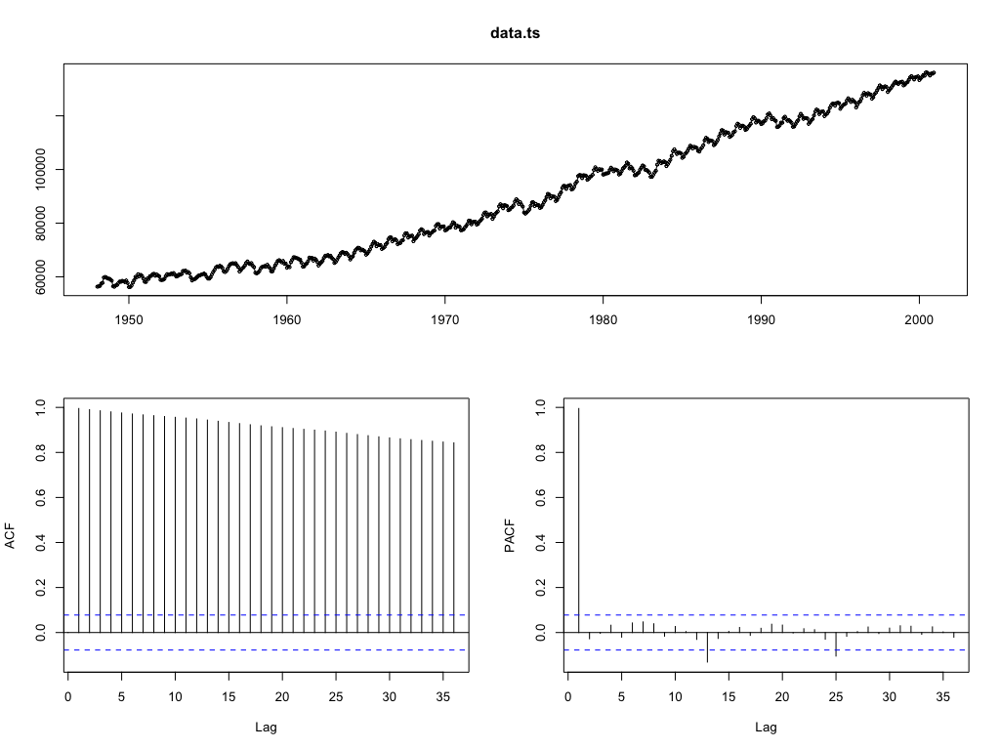
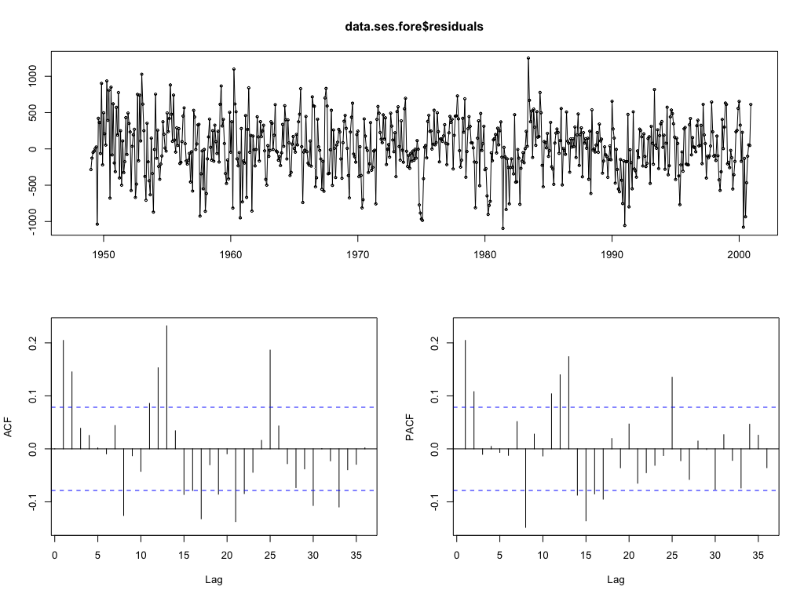

# Exercise 2.3: Univariate Time Series - Exponential Smoothing Models


## For the time series in Exercise 1.1 and 1.2 select an adequate Exponential Smoothing Model to predict future values. Fit the model by estimating its parameters. Verify the model on the basis of the residuals, their (partial) autocorrelations and Goodness-of-Fit measures such as RMSE, MAE and MAPE.

For this exercise, the dataset `laborforce.RData` has been selected (as per professor's suggestion). First we show how to prepare the data in the cell below.

```
# Make the time sequence plot
tsdisplay(data.ts)
```
Initial time sequence plot                            |
:----------------------------------------------------:|
 |

**Analysis**

Since we have corrected the seasonality, we may like trying to fit a Holt model, i.e. only `gamma` parameter set to false (no seasonality). This model contain a equation for trend.

### Fit the model by estimating its parameters and give an interpretation for the parametervalues obtained. 

```
data.ses <- HoltWinters(data.corrected, gamma = FALSE)

Holt-Winters exponential smoothing without trend and without seasonal component.

Call:
HoltWinters(x = data.corrected4, seasonal = "additive")

Smoothing parameters:
 alpha: 0.2479595
 beta : 0.03453373
 gamma: 1

Coefficients:
          [,1]
a   477.827781
b     3.127627
s1  -27.457685
s2  -54.692464
s3  -20.174608
s4   12.919120
s5   18.873607
s6   75.294426
s7  152.888368
s8  134.613464
s9   33.778349
s10 -18.379060
s11 -87.772408
s12 -45.827781
```

Exponential Smoothing fitted                            |
:----------------------------------------------------:|
 |


**Analysis**

The parameters in this case are telling that the importance in the level for the recen past is somehow low. The beta value tells me that the recent trend is taking more importance in the forecasting, but still not really dominant. 

With respect to the coefficients, My last level is negative since, as we can see in the plot, my predication at the last point in time is going down. The trend coefficient is, on the other hand, positive, moving the value a bit to the top with respect with old predictions. This model seems more accurate, but is still showing errors that can be confirmed next.

### Verify the model on the basis of the residuals, their (partial) autocorrelations and Goodness-of-Fit measures such as RMSE, MAE and MAPE. 

We start with the metrics evaluation:

```
with(data.ses, accuracy(fitted, x))

               ME     RMSE      MAE       MPE     MAPE     ACF1 Theil's U
Test set 1.753445 12.86886 9.774438 0.3992849 3.400129 0.424139 0.4211919
```

In contrast to the previous model, the error seems higher since the model is not completely aligning the series though it behaves more "random".

This is not a clear indicator of the performance of the model. So we proceed to forecast and evaluate normality of the residuals and partial autocorrelations.

To verify normality of the residuals, we first forecast 10 values:

```
data.ses.fore <- forecast(data.ses, h = 10)
```

Forecast                            |
:----------------------------------------------------:|
 |


After that, we evaluate normality:

```
> shapiro.test(data.ses.fore$residuals)

    Shapiro-Wilk normality test

data:  data.ses.fore$residuals
W = 0.98834, p-value = 0.3297
```

We reject normality since p-value < 0.05 (we assume significance of 5%). We need to be careful since this test is sensitive to ties which was not verified for our dataset. By looking at the residuals we can observe this in detail.

```
qqnorm(unclass(data.ses.fore$residuals))
qqline(unclass(data.ses.fore$residuals))
```

Normality                            |
:----------------------------------------------------:|
 |

Finally, remember we look for random residuals, we verify if indeed there is randomness in their ACF and PACF.

```
tsdisplay(data.ses.fore$residuals)
```

Autocorrelations                            |
:----------------------------------------------------:|
 |

It can be observed that there is significance in some of the autocorrelations, then we perform a formal test:

```
Box.test(data.ses.fore$residuals, lag = 12, type = "Ljung-Box")

    Box-Ljung test

data:  data.ses.fore$residuals
X-squared = 63.975, df = 12, p-value = 4.215e-09

```

Clearly, this rejects independence due to the p-value < 0.05 and can be observed from the plots that seasonality is present. This is expected since even after the correction, we still observe some residuals of seasonality.

This model is not really accurate and maybe a HoltWinters with seasonality enabled must be tried, even if theoretically we removed it.

## Use the `ets` function to get an automatically selected Exponential Smoothing Model. Verify the model obtained and compare results with those from the previous part of the exercise.

```

```

## Use the Exponential Smoothing Model fitted to forecast the next 12 values of the time series. Also calculate the 95% confidence intervals of the forecasts.
