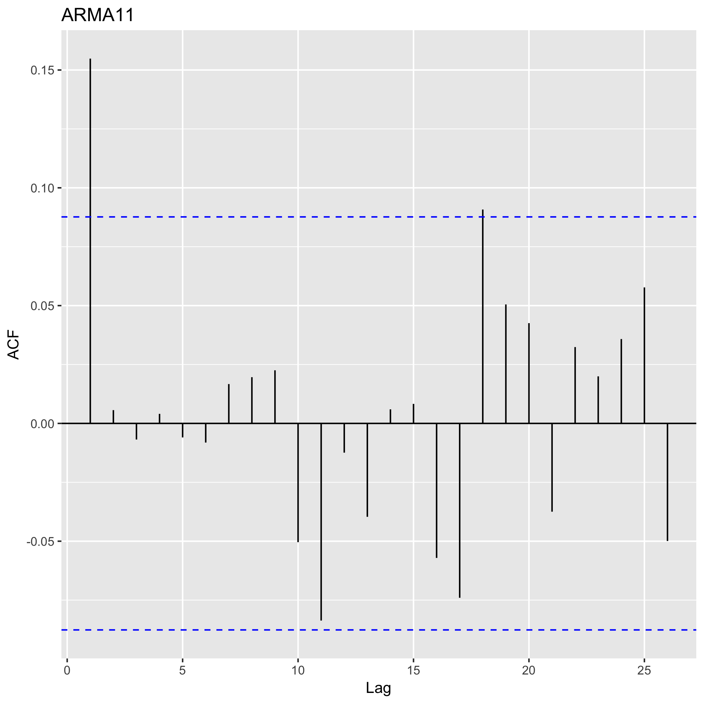
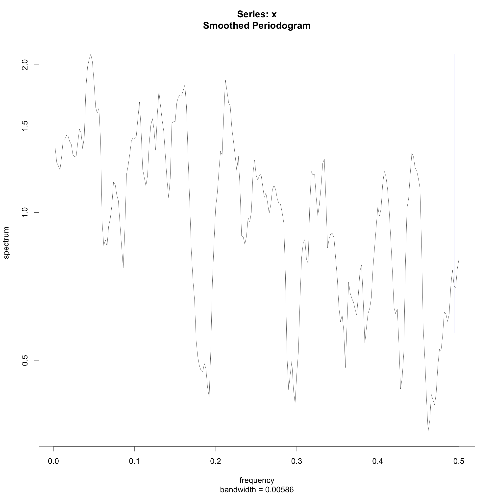

# Exercise 4.1: Box Jenkins Models

Data set needed: `ARMAsimulations.RData`.

Recall that the general equation for ARIMA models is

```
(1 - F_1 * B - F_2 * B^2 - ... - F_p * B^p) * (1 - B)^d * X_t = (1 + G_1 * B + ... G_q * B^q) * Z_t
```

For each of the realizations contained in the dataset:

## ARMA1

### a. Obtain and interpret the time sequence plot, the ACF and PACF as well as the periodogram and spectral density function.

Time series & Spectrum                | ACF (top) & PACF (bottom)         |
|:-----------------------------------:|:---------------------------------:|
|    | |
|||

Low frequencies in the periodogram and trendy behaviour in the ACF. Non seasonality. It outstands the drop after lag 1 in PACF. However the time is broad and the ACF/PACF is working in a very small window.

### b. State a conjecture for the order of the ARIMA-process. Notice that in some cases several candidates might seem reasonable!

- AR(1) because of the PACF drop down to zero.
- MA(0) because ACF can be explained by the AR(1)
- The series look stationary, but the spectrum suggests very important low frequencies and trendy behaviour. Maybe differencing can be needed.

Candidates can be: 

- ARIMA(1, 0, 0) [PREFERRED]
- ARIMA(1, 1, 0)

### c. Check if the behaviour of the ACF and the PACF is consistent, given the model order(s) conjectured.

### d. Express the model(s) conjectured in general operator form. Estimate the parameters in the model, based on the data available and express the model(s) conjectured in specific operator form.


**General operator form**
```
# Alternative 1
(1 - F_1 * B) * X_t = c + Z_t

# Alternative 2
(1 - F_1 * B) * (1 - B) * X_t = c + Z_t
```

**Estimation of the paremeters**
```
Call:
arima(x = data$ARMA1, order = c(1, 0, 0))

Coefficients:
         ar1  intercept
      0.7904    -0.1291
s.e.  0.0274     0.2203

sigma^2 estimated as 1.082:  log likelihood = -729.74,  aic = 1465.49
```

**Specific form**

```
(1 - 0.7904 * B) * X_t = -0.1291 + Z_t
```

### e. Comment on the significance of the individual model parameters.

The interval of the coefficients are

```
[1] "Lower bound of interval"
       ar1  intercept 
 0.7629797 -0.3494397 
[1] "Upper bound of interval"
       ar1  intercept 
0.81777264 0.09117263 
```
ar1 is significant, intercept is not since it contains zero. We can drop the intercept.

## ARMA2

### a. Obtain and interpret the time sequence plot, the ACF and PACF as well as the periodogram and spectral density function.

Time series & Spectrum                | ACF (top) & PACF (bottom)         |
|:-----------------------------------:|:---------------------------------:|
|    | |
|||

The PACF shows a clear drop to 0 after lag 1. The ACF shows a sort of a trend with alternate directions and probably cyclic. From the periodogram we observe that "high" frecuencies are important, maybe seasonality.

### b. State a conjecture for the order of the ARIMA-process. Notice that in some cases several candidates might seem reasonable!

- AR(1) because of the drop to 0 in the PACF after lag 1.
- MA(0) because no clear patter in the ACF nor the PACF with respect to MA
- Seasonal differencing: We may want to perform 1, since the cycle is somehow clear, but working with simple arima for now.
- Trend differencing: Maybe we want to perform 1 differencing.

Candidates is:

- ARIMA(1, 0, 0)

### c. Check if the behaviour of the ACF and the PACF is consistent, given the model order(s) conjectured.

### d. Express the model(s) conjectured in general operator form. Estimate the parameters in the model, based on the data available and express the model(s) conjectured in specific operator form.

**General form**
```
# Alternative 1
(1 - F_1 * B) * X_t = c + Z_t
```

**Estimation**
```
Call:
arima(x = data$ARMA2, order = c(1, 0, 0))

Coefficients:
          ar1  intercept
      -0.7873    -0.0443
s.e.   0.0275     0.0254

sigma^2 estimated as 1.031:  log likelihood = -717.54,  aic = 1441.08
```

**Specific form**

```
# Alternative 1
(1 + 0.7873 * B) * X_t = -0.0443 + Z_t
```

### e. Comment on the significance of the individual model parameters.

```
[1] "Lower bound of interval"
        ar1   intercept 
-0.81476792 -0.06974508 
[1] "Upper bound of interval"
        ar1   intercept 
-0.75986160 -0.01889204 
```

Not significant. Maybe because of non-seasonal part.

## ARMA3

### a. Obtain and interpret the time sequence plot, the ACF and PACF as well as the periodogram and spectral density function.

Time series & Spectrum                | ACF (top) & PACF (bottom)         |
|:-----------------------------------:|:---------------------------------:|
|    | |
|||


Some seasonality at lags 3, 8 according to PACF. The ACF shows some trend behaviour, as well as the realization. The periodogram also shows low frequencies with high importance, as it is the case of trendy series. The higher frequencies can also be significant (maybe seasonality?).
### b. State a conjecture for the order of the ARIMA-process. Notice that in some cases several candidates might seem reasonable!

- AR(2) or AR(3) because then it drops to 0.
- MA(7) since it drops to 0, but also can be parto of the AR component, since it is decaying.
- Differencing: May be applied.

Candidates can be:

- ARIMA(2, 0, 0)
- ARIMA(3, 0, 0)
- ARIMA(2, 0, 7)
- ARIMA(3, 0, 7)
- ARIMA(2, 1, 0)
- ARIMA(3, 1, 0)
- ARIMA(2, 1, 7)
- ARIMA(3, 1, 7)

### c. Check if the behaviour of the ACF and the PACF is consistent, given the model order(s) conjectured.

### d. Express the model(s) conjectured in general operator form. Estimate the parameters in the model, based on the data available and express the model(s) conjectured in specific operator form.

```
Call:
arima(x = data$ARMA3, order = c(3, 1, 0))

Coefficients:
          ar1      ar2      ar3
      -0.4800  -0.0826  -0.1311
s.e.   0.0444   0.0492   0.0444
```

### e. Comment on the significance of the individual model parameters.

## ARMA4

### a. Obtain and interpret the time sequence plot, the ACF and PACF as well as the periodogram and spectral density function.

Time series & Spectrum                | ACF (top) & PACF (bottom)         |
|:-----------------------------------:|:---------------------------------:|
|    | |
|||


### b. State a conjecture for the order of the ARIMA-process. Notice that in some cases several candidates might seem reasonable!

### c. Check if the behaviour of the ACF and the PACF is consistent, given the model order(s) conjectured.

### d. Express the model(s) conjectured in general operator form. Estimate the parameters in the model, based on the data available and express the model(s) conjectured in specific operator form.

### e. Comment on the significance of the individual model parameters.

## ARMA5

### a. Obtain and interpret the time sequence plot, the ACF and PACF as well as the periodogram and spectral density function.

Time series & Spectrum                | ACF (top) & PACF (bottom)         |
|:-----------------------------------:|:---------------------------------:|
|    | |
|||

### b. State a conjecture for the order of the ARIMA-process. Notice that in some cases several candidates might seem reasonable!

### c. Check if the behaviour of the ACF and the PACF is consistent, given the model order(s) conjectured.

### d. Express the model(s) conjectured in general operator form. Estimate the parameters in the model, based on the data available and express the model(s) conjectured in specific operator form.

### e. Comment on the significance of the individual model parameters.

## ARMA6

### a. Obtain and interpret the time sequence plot, the ACF and PACF as well as the periodogram and spectral density function.

Time series & Spectrum                | ACF (top) & PACF (bottom)         |
|:-----------------------------------:|:---------------------------------:|
|    | |
|||


### b. State a conjecture for the order of the ARIMA-process. Notice that in some cases several candidates might seem reasonable!

### c. Check if the behaviour of the ACF and the PACF is consistent, given the model order(s) conjectured.

### d. Express the model(s) conjectured in general operator form. Estimate the parameters in the model, based on the data available and express the model(s) conjectured in specific operator form.

### e. Comment on the significance of the individual model parameters.

## ARMA7

### a. Obtain and interpret the time sequence plot, the ACF and PACF as well as the periodogram and spectral density function.

Time series & Spectrum                | ACF (top) & PACF (bottom)         |
|:-----------------------------------:|:---------------------------------:|
|    | |
|||


### b. State a conjecture for the order of the ARIMA-process. Notice that in some cases several candidates might seem reasonable!

### c. Check if the behaviour of the ACF and the PACF is consistent, given the model order(s) conjectured.

### d. Express the model(s) conjectured in general operator form. Estimate the parameters in the model, based on the data available and express the model(s) conjectured in specific operator form.

### e. Comment on the significance of the individual model parameters.

## ARMA8

### a. Obtain and interpret the time sequence plot, the ACF and PACF as well as the periodogram and spectral density function.

Time series & Spectrum                | ACF (top) & PACF (bottom)         |
|:-----------------------------------:|:---------------------------------:|
|    | |
|||


### b. State a conjecture for the order of the ARIMA-process. Notice that in some cases several candidates might seem reasonable!

### c. Check if the behaviour of the ACF and the PACF is consistent, given the model order(s) conjectured.

### d. Express the model(s) conjectured in general operator form. Estimate the parameters in the model, based on the data available and express the model(s) conjectured in specific operator form.

### e. Comment on the significance of the individual model parameters.

## ARMA9

### a. Obtain and interpret the time sequence plot, the ACF and PACF as well as the periodogram and spectral density function.

Time series & Spectrum                | ACF (top) & PACF (bottom)         |
|:-----------------------------------:|:---------------------------------:|
|    | |
|||

### b. State a conjecture for the order of the ARIMA-process. Notice that in some cases several candidates might seem reasonable!

### c. Check if the behaviour of the ACF and the PACF is consistent, given the model order(s) conjectured.

### d. Express the model(s) conjectured in general operator form. Estimate the parameters in the model, based on the data available and express the model(s) conjectured in specific operator form.

### e. Comment on the significance of the individual model parameters.

## ARMA10

### a. Obtain and interpret the time sequence plot, the ACF and PACF as well as the periodogram and spectral density function.

Time series & Spectrum                | ACF (top) & PACF (bottom)         |
|:-----------------------------------:|:---------------------------------:|
|    | |
|||

### b. State a conjecture for the order of the ARIMA-process. Notice that in some cases several candidates might seem reasonable!

### c. Check if the behaviour of the ACF and the PACF is consistent, given the model order(s) conjectured.

### d. Express the model(s) conjectured in general operator form. Estimate the parameters in the model, based on the data available and express the model(s) conjectured in specific operator form.

### e. Comment on the significance of the individual model parameters.

## ARMA11

### a. Obtain and interpret the time sequence plot, the ACF and PACF as well as the periodogram and spectral density function.

Time series & Spectrum                | ACF (top) & PACF (bottom)         |
|:-----------------------------------:|:---------------------------------:|
|    | |
|||

### b. State a conjecture for the order of the ARIMA-process. Notice that in some cases several candidates might seem reasonable!

### c. Check if the behaviour of the ACF and the PACF is consistent, given the model order(s) conjectured.

### d. Express the model(s) conjectured in general operator form. Estimate the parameters in the model, based on the data available and express the model(s) conjectured in specific operator form.

### e. Comment on the significance of the individual model parameters.

## ARMA12

### a. Obtain and interpret the time sequence plot, the ACF and PACF as well as the periodogram and spectral density function.

Time series & Spectrum                | ACF (top) & PACF (bottom)         |
|:-----------------------------------:|:---------------------------------:|
|    | |
|||


### b. State a conjecture for the order of the ARIMA-process. Notice that in some cases several candidates might seem reasonable!

### c. Check if the behaviour of the ACF and the PACF is consistent, given the model order(s) conjectured.

### d. Express the model(s) conjectured in general operator form. Estimate the parameters in the model, based on the data available and express the model(s) conjectured in specific operator form.

### e. Comment on the significance of the individual model parameters.
