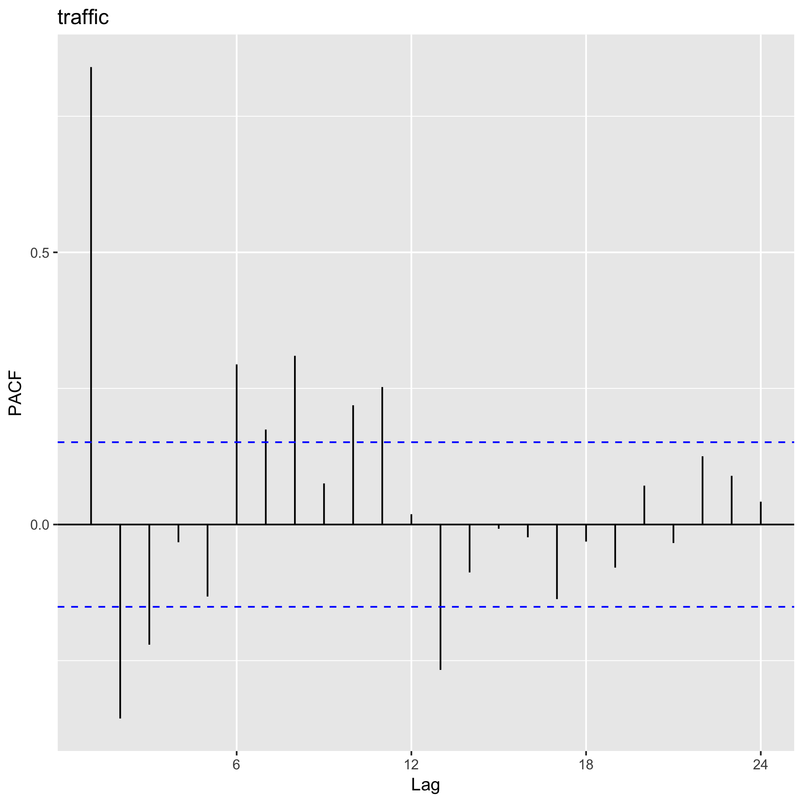

# Exercise 4.2

The dataset `GoldenGate.RData` contains information about the monthly traffic volumes on the Golden Gate bridge over a 14-years period. We want to model these data with an adequate `SARIMA(p,d,q)x(P,D,Q)s` processes:

### a. Obtain and interpret the time sequence plot, the ACF and PACF as well as the periodogram and spectral density function.

Time series & Spectrum                | ACF (top) & PACF (bottom)         |
|:-----------------------------------:|:---------------------------------:|
|    | |
|||


An slow trend is observed in the series. There is some cyclic behaviour but it is not clear where exactly this occurs since none of the CF show a clear patter. It can be that the trend is hidding this pattern. We apply the differencing to observe this better.

After one differencing and 2-times seasonal differencing, we obtain the next close to stationary data:

Time series & Spectrum                |
|:-----------------------------------:|
|  |

### b. State a conjecture for the order of the ARIMA-process. Notice that in some cases several candidates might seem reasonable!

Normal ARIMA:
- AR(1): If we consider the drop to almost 0 PACF
- MA(1): if we consider the drop to almost 0 in the ACF [Prefered since it explains also PACF]

Seasonal ARIMA:
- AR(1) We consider that the seasonality is exponentially decaying at lag 12, and that is droping to 0 in PACF

Candidates can be:

- 12-SARIMA(0, 1, 1)x(1, 1, 0)
- 12-SARIMA(1, 1, 0)x(1, 1, 0)
- 12-SARIMA(1, 1, 1)x(1, 1, 0)

### c. Check if the behaviour of the ACF and the PACF is consistent, given the model order(s) conjectured.

### d. Express the model(s) conjectured in general operator form. Estimate the parameters in the model, based on the data available and express the model(s) conjectured in specific operator form.


The model with the lower AICc was: `12-SARIMA(1, 1, 1)x(1, 1, 0)`

```
Series: data.ts 
ARIMA(1,1,0)(1,1,0)[12] 

Coefficients:
          ar1     sar1
      -0.2382  -0.4848
s.e.   0.0782   0.0673

sigma^2 estimated as 6.167:  log likelihood=-361.55
AIC=729.11   AICc=729.27   BIC=738.24
```

### e. Comment on the significance of the individual model parameters.


```
         [,1]      [,2]
ar1 0.2536044 0.6825334
          [,1]       [,2]
ma1 -0.9231944 -0.5849269
           [,1]       [,2]
sar1 -0.5553641 -0.4203849

```

None of the coefficients contain 0, then they are significant.


Forecast                |
|:-----------------------------------:|
|  |
