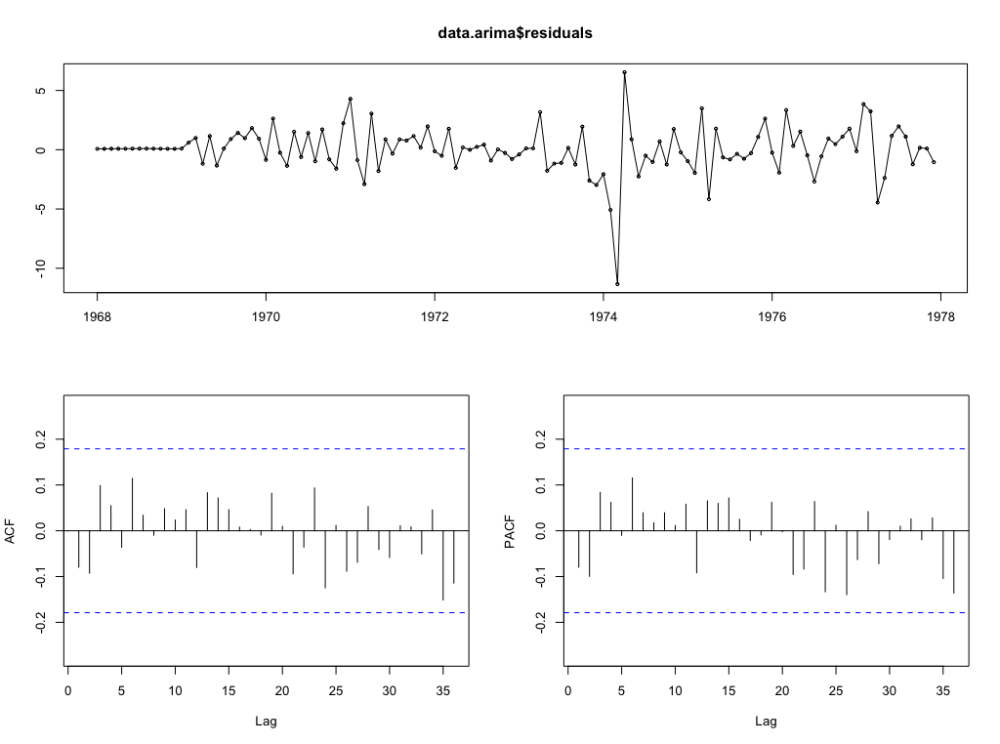

# Exercise 4.4

In Exercise 4.2 you modeled, based on the dataset `GoldenGate.RData`, the monthly traffic volumes on the Golden Gate bridge with a SARIMA(p,d,q)x(P,D,Q)s processes.

You selected, for one of the candidate models, the order and estimated the coefficients of the model. However, several candidate models might have been appropriate. Therefore, in this exercise, select at least two candidate models that might seem reasonable, for further verification and validation of the model obtained. Suggested models might be: `SARIMA (0,1,1)x(0,1,0)12` , `SARIMA (0,1,2)x(0,1,0)12` , `SARIMA (1,1,0)x(1,1,0)12` or `SARIMA (1,1,2)x(1,1,0)12` .

Furthermore, using the `window` function from the `fpp/forecast` package select the data points between January 1968 and December 1977 for fitting the model. The remaining data points may then be used for independent model validation.

## a. For the candidate models selected, estimate values for the model parameters based on the (restricted!) fitting data and express the models in specific operator form. Comment on the significance of the individual model parameters estimated.


### Mine

**Fit**

```
ARIMA(1,1,1)(1,1,0)[12] 

Coefficients:
         ar1      ma1     sar1
      0.2314  -0.5601  -0.4338
s.e.  0.2898   0.2526   0.0847

sigma^2 estimated as 5.832:  log likelihood=-245.97
AIC=499.93   AICc=500.32   BIC=510.62
```

**Significance of the individual model parameters**


```
           [,1]      [,2]
ar1 -0.05841149 0.5212207
          [,1]       [,2]
ma1 -0.8126568 -0.3074824
           [,1]      [,2]
sar1 -0.5185713 -0.349113
```

ar1 non significant. Others are significant.

### Professor's

**Fit**

```
ARIMA(0,1,1)(0,1,0)[12] 

Coefficients:
          ma1
      -0.3821
s.e.   0.0998

sigma^2 estimated as 7.303:  log likelihood=-257.77
AIC=519.53   AICc=519.65   BIC=524.88
```

**Significance of the individual model parameters**

```
          [,1]       [,2]
ma1 -0.4819422 -0.2822793
```

ma1 is significant

## b. Indicate how a one-step ahead prediction, `x^t (1)`, can be estimated from the models fitted!

Formulate the general form of the SARIMA process and then follow the steps:

- Replace values of Z in the validation period by 0
- Replace values of X in the validation period by their conditional expectation
- Replace values of Z and X in the training period by their observed values


## c. For the candidate models selected, plot the residual autocorrelation and partial autocorrelation functions. Interpret and compare the results!

Mine                           | Professor's
|:---------------------------:|:---------------------------:|
| | |


**Analysis**

In my approach, there's still some seasonality. observed. But ACF and PACF are following the same pattern. This is only in the first two seasonal lags, so maybe we can a MA(2).

In professor's approach a similar thing happens, but maybe a MA(1) can also be suitable in that case. 

## d. For the candidate models selected, determine adequate fit measures and the Ljung-Box statistics. Interpret and compare the results!

### Mine

**Accuracy**

```
                      ME     RMSE      MAE         MPE     MAPE      MASE         ACF1
Training set -0.01772994 2.248201 1.448712 -0.04439806 1.614758 0.4666505 -0.001403683
```

**Ljung-Box statistic**

```
    Box-Ljung test

data:  data.arima$residuals
X-squared = 9.4288, df = 12, p-value = 0.6659
```

### Professor's

**Accuracy**

```
                      ME     RMSE      MAE         MPE     MAPE      MASE       ACF1
Training set -0.01818799 2.539792 1.634993 -0.04637376 1.811304 0.5266542 0.04047506
```

**Ljung-Box statistic**

```
    Box-Ljung test

data:  data.arima$residuals
X-squared = 29.162, df = 12, p-value = 0.003727
```

### Comparison

In general, both models perform well. The RMSE is quite close as well as the MAPE. My model gave less errors in the training data. 

## e. For the candidate models selected, obtain adequate plots for individual models. Explain the difference between fitted values and forecasts. Interpret and compare the results!

Mine                           | Professor's
|:---------------------------:|:---------------------------:|
| | |
| | |
| | |
| | |


In terms of the forecasting, the professor's model seems to overfit the last observed pattern. They handled the outlier similarly. 

The residuals behave more or less as they did for the model.


**Validation of the forecasting**

### Mine

**Accuracy**

```
                      ME     RMSE      MAE         MPE     MAPE      MASE         ACF1 Theil's U
Training set -0.01772994 2.248201 1.448712 -0.04439806 1.614758 0.4666505 -0.001403683        NA
Test set     -1.72552638 3.249402 2.714831 -1.82110503 2.791384 0.8744851  0.699073556 0.8102621
```
**Ljung-Box test**

```
    Box-Ljung test

data:  data.arima.fore$residuals
X-squared = 9.4288, df = 12, p-value = 0.6659
```

****
### Professor's

```
                       ME     RMSE      MAE         MPE     MAPE      MASE       ACF1 Theil's U
Training set -0.018187994 2.539792 1.634993 -0.04637376 1.811304 0.5266542 0.04047506        NA
Test set      0.006666039 2.481256 1.946339 -0.06469792 1.993384 0.6269429 0.61488799 0.6145615
```

**Ljung-Box test**

```
    Box-Ljung test

data:  data.arima.fore$residuals
X-squared = 29.162, df = 12, p-value = 0.003727
```

### Comparison

My models looks better for accuracy and the independence of residuals.

## f. Based on the results obtained so far, select from the candidate models the preferred one. Explain your choice!

Mine because previous questions.

## g. Finally, use the `auto.arima` function to automatically select an adequate ARMA-model. Compare the results obtained with your best choice in part f !

```
ARIMA(1,0,0)(2,1,0)[12] with drift 

Coefficients:
         ar1     sar1     sar2   drift
      0.8341  -0.6165  -0.4079  0.1154
s.e.  0.0551   0.0897   0.0835  0.0523

sigma^2 estimated as 4.654:  log likelihood=-238.22
AIC=486.44   AICc=487.03   BIC=499.85
```

**Accuracy**

```
                     ME     RMSE      MAE         MPE     MAPE      MASE        ACF1
Training set 0.01339537 2.008359 1.332026 -0.01492925 1.480692 0.4290642 -0.07945495
```

**Results**

Original                      | Forecasting |
|:---------------------------:|:---------------------------:|
| | |
| | |
|| |

**Ljung-Box statistic**

```
    Box-Ljung test

data:  data.arima$residuals
X-squared = 6.9683, df = 12, p-value = 0.8597
```

