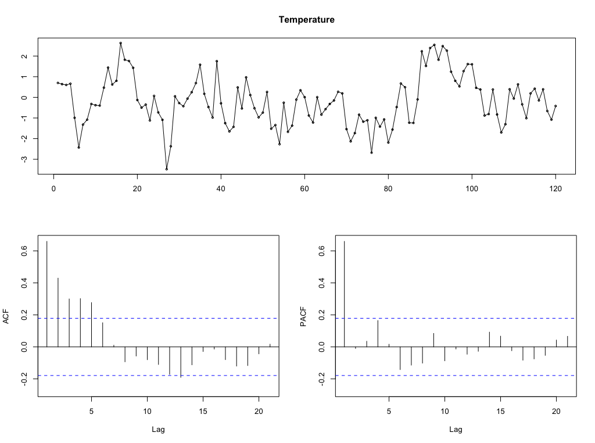

# Exercise 5.4

The dataset `viscosity.RData` contains information about viscosity and temperature measured for the engine oil of a car. Data are sampled at a regular rate. We want to model the viscosity data both without and with taking the temperature data into account as an explanatory variable.

## a. Perform an exploratory data analysis on the viscosity and temperature data, both for the individual series and for their mutual relations. Based on the results are transformations needed?

Temperature                     | Viscosity
|:-----------------------------:|:-----------------------------:|
| | |
| | |


Relation                   |
|:---------------------------:|
| |

## b. Fit an adequate univariate Box Jenkins model to the viscosity data. Discuss the steps taken and the choices made and give an explicit formulary form for the model obtained.

Fitted                          | Forecast
|:-----------------------------:|:-----------------------------:|
| | |
| | |

**Results of fit**

```
Series: data.ts 
ARIMA(5,0,0) with non-zero mean 

Coefficients:
         ar1      ar2      ar3     ar4     ar5     mean
      0.6793  -0.3146  -0.0750  0.1044  0.1934  -0.3816
s.e.  0.0899   0.1103   0.1143  0.1115  0.0915   0.2619

sigma^2 estimated as 1.543:  log likelihood=-193.79
AIC=401.58   AICc=402.58   BIC=421.09
```

**Significance of parameters**

```
         [,1]      [,2]
ar1 0.5893859 0.7691146
          [,1]       [,2]
ar2 -0.4248651 -0.2042948
          [,1]       [,2]
ar3 -0.1892953 0.03937654
            [,1]      [,2]
ar4 -0.007071922 0.2159359
         [,1]      [,2]
ar5 0.1019107 0.2848771
                [,1]       [,2]
intercept -0.6434827 -0.1196648

         ar1          ar2          ar3          ar4          ar5    intercept 
4.063416e-14 4.338722e-03 5.120773e-01 3.489762e-01 3.451671e-02 1.451455e-01 
```

**Accuracy**
```
                      ME      RMSE       MAE      MPE     MAPE      MASE        ACF1
Training set -0.01029311 0.8863187 0.7049251 143.2741 223.5446 0.8969855 0.003759223
```

**Normality of residuals**
```
    Shapiro-Wilk normality test

data:  data.arima$residuals
W = 0.99334, p-value = 0.8408
```

```
    Box-Ljung test

data:  data.arima$residuals
X-squared = 1.6123, df = 10, p-value = 0.9985
```

## c. Use the `Arima()` function to fit, in line with the 2DD23-lecture notes _Exploring Multivariate Time Series_, a dynamic regression model with viscosity as the dependent and temperature as the independent variable. Start with a simple proxy model for the noise part, eg. `AR(2)`, explicitly formulate the model obtained and check significance of the parameters fitted in the model. Furthermore, check the fingerprint of the residuals of the fitted model: are they close to white noise? If not, experiment with other choices for the proxy model of the noise part!

Fitted                          | Residuals
|:-----------------------------:|:-----------------------------:|
| | |

**Results of fit**

```
Series: data.ts 
Regression with ARIMA(3,0,0) errors 

Coefficients:
         ar1      ar2     ar3  intercept  data.ts[, 2]
      0.6616  -0.0226  0.0443    -0.1886       -0.0457
s.e.  0.0907   0.1095  0.0912     0.2542        0.0589

sigma^2 estimated as 0.8392:  log likelihood=-157.5
AIC=326.99   AICc=327.73   BIC=343.72
```

**Significance of parameters**

```
         [,1]      [,2]
ar1 0.5708049 0.7523035
          [,1]       [,2]
ar2 -0.1321338 0.08684987
           [,1]      [,2]
ar3 -0.04691131 0.1354478
                [,1]       [,2]
intercept -0.4428701 0.06562135
                   [,1]       [,2]
data.ts[, 2] -0.1046007 0.01311533
         ar1          ar2          ar3    intercept data.ts[, 2] 
3.101963e-13 8.361729e-01 6.273173e-01 4.581492e-01 4.370584e-01 
```

**Accuracy**
```
                       ME      RMSE       MAE      MPE     MAPE     MASE         ACF1
Training set -0.007604184 0.8967799 0.7060328 143.6583 235.3752 0.898395 -0.004622048
```

**Normality of residuals**
```
    Shapiro-Wilk normality test

data:  data.arima$residuals
W = 0.99384, p-value = 0.8792
```

```
    Box-Ljung test

data:  data.arima$residuals
X-squared = 12.184, df = 10, p-value = 0.2729
```

## d. Use the `auto.arima()` function to fit, in line with the 2DD23-lecture notes "Exploring Multivariate Time Series", in an automated way a dynamic regression model with viscosity as the dependent and temperature as the independent variable. Explicitly formulate the model obtained and check significance of the parameters fitted in the model. Furthermore, check the fingerprint of the residuals of the fitted model: are they close to white noise?

Fitted                          | Residuals
|:-----------------------------:|:-----------------------------:|
| | |

**Results of fit**

```
Regression with ARIMA(1,0,0) errors 

Coefficients:
         ar1     xreg
      0.6738  -0.0393
s.e.  0.0675   0.0579

sigma^2 estimated as 0.8234:  log likelihood=-157.91
AIC=321.82   AICc=322.03   BIC=330.18
```

**Significance of parameters**

```
         [,1]      [,2]
ar1 0.6062445 0.7412902
            [,1]       [,2]
xreg -0.09725587 0.01861261
      ar1      xreg 
0.0000000 0.4973098 
```

**Accuracy**
```
                      ME      RMSE       MAE      MPE     MAPE      MASE         ACF1
Training set -0.06859297 0.8998432 0.7097254 133.7556 243.5188 0.9030937 -0.009317755
```

**Normality of residuals**
```
    Shapiro-Wilk normality test

data:  data.arima$residuals
W = 0.99381, p-value = 0.8769
```

```
    Box-Ljung test

data:  data.arima$residuals
X-squared = 12.433, df = 10, p-value = 0.2571
```

## e. Compare results for both the univariate and the dynamic regression models, based on the 'Fit Measures' available. Did the model gain from including temperature as an explanatory variable?

